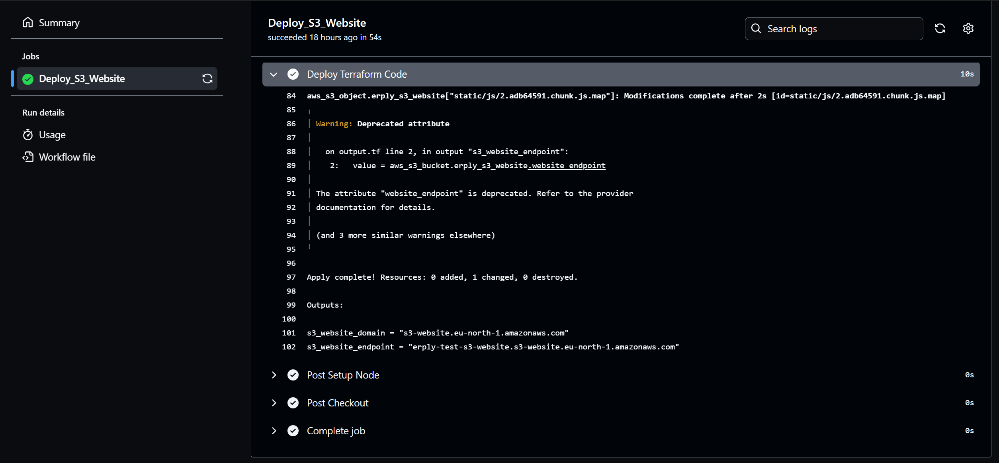
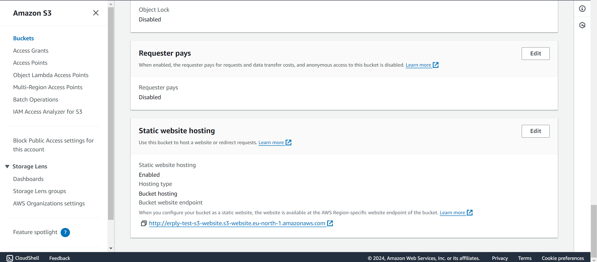
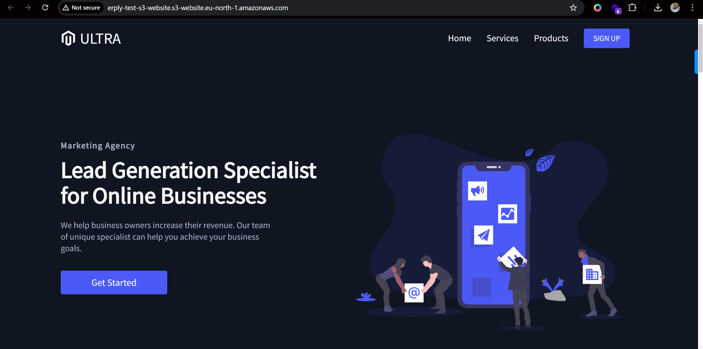
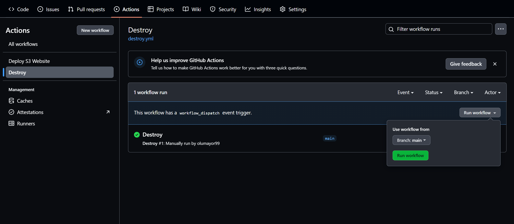

# Deploying a React Website to AWS S3 using Terraform and GitHub Actions

A task explaining the process of deploying a React website to an AWS S3 bucket using Terraform for infrastructure management and GitHub Actions for continuous deployment.

## Prerequisites
Before you begin, ensure you have the following:

1. An [AWS](https://aws.amazon.com) account. Free tier is okay.
2. [AWSCLI](https://docs.aws.amazon.com/cli/latest/userguide/getting-started-install.html) installed and configured on your machine.
3. [Terraform](https://developer.hashicorp.com/terraform/downloads) installed on your local machine.
4. [GitHub Account](https://github.com/) to use its repository for the project.
5. [Node.js and npm](https://www.freecodecamp.org/news/node-version-manager-nvm-install-guide/) installed on your local machine.

## Project Structure
Here's an overview of the project structure:

```sh
$ tree
.
|-- Landing-Page-React
|   |-- README.md
|   |-- UltraDesktop.png
|   |-- UltraIPad.png
|   |-- UltraIPhone.png
|   |-- package-lock.json
|   |-- package.json
|   |-- public
|   |   |-- index.html
|   |   |-- manifest.json
|   |   `-- robots.txt
|   `-- src
|       |-- App.js
|       |-- components
|       |   |-- Footer
|       |   |   |-- Footer.elements.js
|       |   |   `-- Footer.js
|       |   |-- InfoSection
|       |   |   |-- InfoSection.elements.js
|       |   |   `-- InfoSection.js
|       |   |-- Navbar
|       |   |   |-- Navbar.elements.js
|       |   |   `-- Navbar.js
|       |   |-- Pricing
|       |   |   |-- Pricing.elements.js
|       |   |   `-- Pricing.js
|       |   |-- ScrollToTop.js
|       |   `-- index.js
|       |-- globalStyles.js
|       |-- images
|       |   |-- profile.jpg
|       |   |-- svg-1.svg
|       |   |-- svg-2.svg
|       |   `-- svg-3.svg
|       |-- index.css
|       |-- index.js
|       |-- pages
|       |   |-- HomePage
|       |   |   |-- Data.js
|       |   |   `-- Home.js
|       |   |-- Products
|       |   |   |-- Data.js
|       |   |   `-- Products.js
|       |   |-- Services
|       |   |   |-- Data.js
|       |   |   `-- Services.js
|       |   `-- SignUp
|       |       |-- Data.js
|       |       `-- SignUp.js
|       `-- reportWebVitals.js
|-- README.md
|-- Terraform
|   |-- output.tf
|   |-- provider.tf
|   |-- s3.tf
|   `-- variable.tf
`-- assets
    |-- destroy.png
    |-- page.png
    |-- s3_bucket.png
    `-- s3_website.png
```

## Steps
1. Fork the repository to your GitHub account if you haven't already, and clone it to your local machine:

```sh
git clone <REPOSITORY>
```
2. Create an AWS access key in AWS IAM for Terraform with Administrator permissions (overkill, but just for this task). Download the generated CSV file, and run `aws configure` on your machine. Supply the access key and secret (copied from the CSV file) at the prompts.
3. Create an S3 bucket and DynamoDB table to use for state locking. You should create them through the AWS Dashboard. Use only stepd 2 and 5 of [this](https://terraformguru.com/terraform-real-world-on-aws-ec2/20-Remote-State-Storage-with-AWS-S3-and-DynamoDB/) guide. make sure you create them in the same region.
4. Open the [provider.tf](Terraform/provider.tf) file and replace the values of the `bucket` and `dynamodb_table` with the ones you just created, also making sure the `region` is correct. `key` can be any string, but make sure it has the `.tfstate` extension.

```groovy
backend "s3" {
    bucket         = "olatest-logger-lambda"
    key            = "terraform/s3_website/deployment.tfstate"
    region         = "us-east-1"
    dynamodb_table = "terraform-s3-backend-locking"
    encrypt        = true
  }
```
5. Open the [variable.tf](Terraform/variable.tf) file and replace the value of `s3_bucket_name` with a unique name. Remember, S3 buckets are globally unique, just like URLs.

```groovy
variable "s3_bucket_name" {
  type        = string
  default     = "erply-test-s3-website" #REPLACE
  description = "AWS S3 Bucket Name"
}
```
6. Go to the repository you forked in your GitHub account, and create the following repository secrets. Get their values from the IAM file (CSV) downloaded earlier:
   - AWS_ACCESS_KEY_ID 
   - AWS_SECRET_ACCESS_KEY
7. Commit the code and push to the repository.

```sh
git add .
git commit -m "Pushed my code"
git push origin main
```
8. Go to the Actions tab in your repository, you'll see the `Deploy S3 Website` workflow running. Once the jobs finish successfully, click on the `Deploy Terraform` step and go to the end of the logs to see the `s3_website_endpoint`.
   


If you can't find it there, go to the s3 tab in your AWS console, and look for the bucket matching the name you specified in the [variable.tf](Terraform/variable.tf) file. Select the bucket, click on `Properties`, and scroll to the bottom of the page to find the URL of the S3 website.



Visiting the link in a browser should show a page exactly like this.



The React website should now be automatically deployed to your S3 bucket every time you push changes to the main branch.

## Pulling down the infrastructure
1. Go to the Actions tab of the repository, and on the left pane, click on `Destroy`, then on the right, click on `Run Workflow` dropdown, then click on the `Run Workflow` green button. It will take down the infrastructure provisioned by the pipeline.



2. Delete the S3 bucket and DynamoDB table created for state locking using the AWS console.

## Explanation of the workflow
This is the deploy.yml workflow. It triggers on every commit to the `main` branch of the repository. It sets the needed variables, some from GitHub secrets, and the rest supplied directly. It checks out the code, sets up `node` with version 16 (any other version won't work), and then it builds the code. The built code is stored in the `build` directory which it creates during the build process. The rest of the steps initialize and deploy the workload using terraform.

```yaml
name: Deploy S3 Website

on:
  push:
    branches:
      - main
env:
    AWS_ACCESS_KEY_ID: ${{ secrets.AWS_ACCESS_KEY_ID }}
    AWS_SECRET_ACCESS_KEY: ${{ secrets.AWS_SECRET_ACCESS_KEY }}
    AWS_DEFAULT_REGION: 'us-east-1'
    CI: false

jobs:
  
  
  Deploy_S3_Website:
    runs-on: ubuntu-latest

    steps:
      - name: Checkout
        uses: actions/checkout@v4

      - name: Setup Node
        uses: actions/setup-node@v4
        with:
          node-version: 16

      - name: NPM build
        run: |
          cd Landing-Page-React
          npm install
          npm run build      

      - name: Set up Terraform
        uses: hashicorp/setup-terraform@v3
        with:
          terraform_version: 1.8

      - name: Inititialize Terraform
        run: terraform -chdir=Terraform init -upgrade

      - name: Format Terraform Code
        run: terraform -chdir=Terraform fmt

      - name: Deploy Terraform Code
        run: terraform -chdir=Terraform apply -auto-approve
```

## Explanation of the Terraform code
The terraform code creates an S3 bucket with all the needed configuration for an S3 website, and once that's done, it uploads the production ready code in the `build` directory into the S3 website so it can serve them across the internet.
This is the section that deals with uploading the production ready code to S3:

```groovy
locals {
  content_types = {
    css  = "text/css"
    html = "text/html"
    js   = "application/javascript"
    json = "application/json"
    txt  = "text/plain"
    png  = "image/png"
    svg  = "image/svg+xml"
  }
}

resource "aws_s3_object" "erply_s3_website" {
  for_each     = fileset("../Landing-Page-React/build/", "**/*.*")
  bucket       = aws_s3_bucket.erply_s3_website.id
  key          = each.value
  source       = "../Landing-Page-React/build/${each.value}"
  etag         = filemd5("../Landing-Page-React/build/${each.value}")
  acl          = "public-read"
  content_type = lookup(local.content_types, element(split(".", each.value), length(split(".", each.value)) - 1), "text/plain")
  depends_on = [aws_s3_bucket_policy.erply_s3_website]
}
```

The `content_types` local is necessary so the S3 website can correctly decode the object types and serve them in a webpage, instead of as an ordinary file.